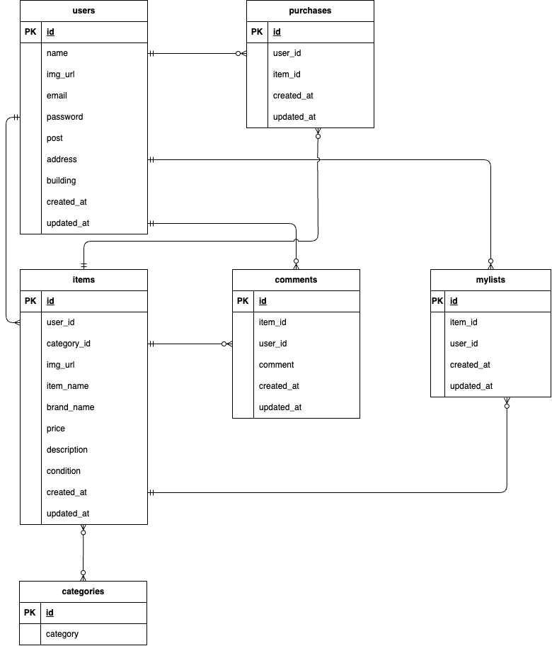

# free-market-app

## 環境構築

### Docker ビルド

1. git clone git@github.com:YamadaNanami/free-market-app.git

2. docker-compose up -d --build

### Laravel 環境構築

1. docker-compose exec php bash

2. composer install

3. composer create-project "laravel/laravel=8.\*" . --prefer-dist

4. config/app.php ファイルの'timezone'を修正する

5. php artisan tinker

6. echo Carbon\Carbon::now()

7. .env.example ファイルから.env ファイルを作成し、下記の環境変数を編集する（コメントアウトされている箇所はコメントアウトを解除する）

   - 追加する環境変数
     | 項目 | 設定する値 |
     | ---------------- | -------------------------------------- |
     | STRIPE_KEY | "Stripe の API キー　パブリックキー" |
     | STRIPE_SECRET | "Stripe の API キー　シークレットキー" |
     | CASHIER_CURRENCY | jpy |

   - 変更する環境変数
     | 項目 | 変更前の値 | 変更後の値 |
     | ----------- | ---------------------- | ------------------ |
     | DB_HOST | 127.0.0.1 | mysql |
     | DB_DATABASE | laravel | laravel_db |
     | DB_USERNAME | root | laravel_user |
     | DB_PASSWORD | | laravel_pass |
     | MAIL_FROM_ADDRESS | null | "送信元アドレスを設定する" |

8. php artisan key:generate

9. php artisan migrate

10. Storage/app/public 配下に以下の img ディレクトリを移動させる

```
.
├── docker
├── img ←このディレクトリを丸ごとStorage/app/public配下に移動させる
│   ├── chat_img
│   ├── item_img
│   └── ...
├── src
├── README.md
└── docker-compose.yml
```

11. php artisan storage:link

## 単体テスト準備

1. テスト用 DB を作成する

```
//テスト用データベースの作成
docker-compose exec mysql bash
mysql -u root -p
//パスワードはrootと入力
CREATE DATABASE demo_test;

docker-compose exec php bash
php artisan migrate --env=testing
```

2. config/database.php を開き、 mysql の配列部分をコピーして新たに mysql_test を作成し、以下の項目を修正する

   | 項目       | 変更前                      | 変更後      |
   | ---------- | --------------------------- | ----------- |
   | 'database' | env('DB_DATABASE', 'forge') | 'demo_test' |
   | 'username' | env('DB_USERNAME', 'forge') | 'root'      |
   | 'password' | env('DB_SOCKET', '')        | 'root'      |

3. PHP コンテナにログインし、.env をコピーして.env.testing ファイルを作成する

```

cp .env .env.testing

```

4. .env.testing ファイルの以下項目を編集する

   | 項目        | 変更前の値             | 変更後の値         |
   | ----------- | ---------------------- | ------------------ |
   | APP_ENV     | local                  | test               |
   | APP_KEY     | (キーが入っている状態) | （キーを削除する） |
   | DB_DATABASE | laravel_db             | demo_test          |
   | DB_USERNAME | laravel_user           | root               |
   | DB_PASSWORD | laravel_pass           | root               |

5. テスト用アプリケーションキーを作成する

```

php artisan key:generate --env=testing

```

6. キャッシュを削除する

```

php artisan config:clear

```

7. phpunit.xml の下記のコメントアウトを外す

```
<!-- <server name="DB_CONNECTION" value="sqlite"/> -->
<!-- <server name="DB_DATABASE" value=":memory:"/> -->
```

## Stripe について

コンビニ支払いとカード支払いのオプションがありますが、決済画面にてコンビニ支払いを選択しますと、レシートを印刷する画面に遷移します。<br>
そのため、カード支払いを成功させた場合に意図する画面遷移が行える想定です。

以下のリンクは公式ドキュメントです。<br>
https://docs.stripe.com/payments/checkout?locale=ja-JP

## 使用技術（実行環境）

- PHP 7.4.9
- Laravel 8.83.29
- MySQL 8.0.26
- nginx 1.21.1

## ER 図



## URL

- 開発環境：http://localhost/
- phpMyAdmin：http://localhost:8080/
- MailHog：http://localhost:8025/
